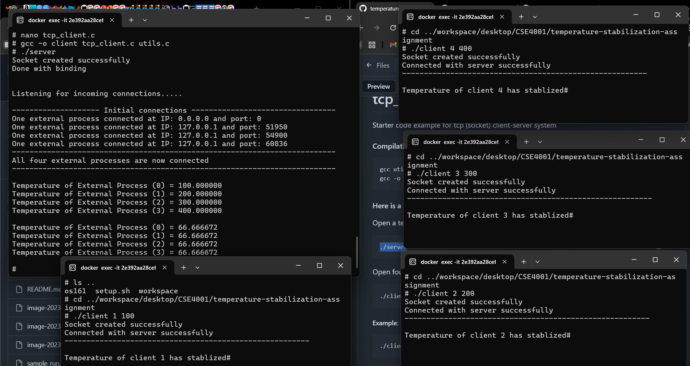

# Temperature stabilization using inter-process communication

assignment completed using docker image.
used for loops for continuous communication between client and server.

 

#### Compilation:

```shell
gcc utils.c tcp_server.c -o server
gcc -o client tcp_client.c utils.c
```

Commands Used: 

```shell
./server
```  

```shell
./client 1 100
```

```shell
./client 2 200
```

```shell
./client 3 300
```

```shell
./client 4 400
```


The book is written is a very conversational style that is both enjoyable and accessible. I think you will enjoy reading it. Give it a try if you have time. If you want just to learn about serialization in network communication then read the Section **7.5 Serialization—How to Pack Data** (https://beej.us/guide/bgnet/html/split-wide/slightly-advanced-techniques.html#serialization). 

 
